<div align="center">

```text
  ____  ____  _____ ____ ____    ____ _____  _    ____ _____ 
 |  _ \|  _ \| ____/ ___/ ___|  / ___|_   _|/ \  |  _ \_   _|
 | |_) | |_) |  _| \___ \___ \  \___ \ | | / _ \ | |_) || |  
 |  __/|  _ <| |___ ___) |__) |  ___) || |/ ___ \|  _ < | |  
 |_|   |_| \_\_____|____/____/  |____/ |_/_/   \_\_| \_\|_|  
                                                             
   [ xTSG-04 SYSTEM ARCHITECTURE ]  •  [ 640K RAM DETECTED ]
```

[](https://git.io/typing-svg)

---

</div>



> Testing

```ini
[OPERATOR_INFO]
USER        = "Tomás González"
CLASS       = "Computer Engineering Student"
LOCATION    = "Patagonia, Argentina"
SPECIALTY   = "Testing"
HOBBIES     = "Mechanical Keyboards • Retro Emulation • Music"
STATUS      = "Testing my new profile readme project"
```

---



**[ CORE RUNTIMES & LANGUAGES ]**

  Something something

**[ BACKEND & INFRASTRUCTURE ]**
  
  Something something again...

---


Nothing, i said testing!

---


<div align="center">


<br/>


</div>

---


<div align="center">

I - S A I D -  N O T H I N G - ! ! !

</div>