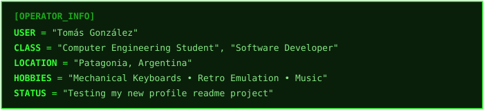
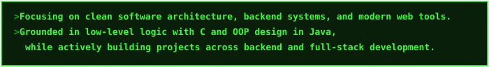

 

 

---

 

 

---

 

 

  &nbsp;
  &nbsp;
  &nbsp;
  &nbsp;
  

 

  &nbsp;
  &nbsp;
  &nbsp;
  &nbsp;
  &nbsp;
  &nbsp;
  
  &nbsp;
  &nbsp;
  &nbsp;
  

---

 

| REPOSITORY | STACK | DESCRIPTION |
| :--- | :--- | :--- |
| [`HERMANOS JOTA`](https://github.com/tsgexe/sprint2-grupo14-itbafullstack) | `HTML5` `CSS3` `JAVASCRIPT` | Collaborative coursework project: responsive furniture e-commerce storefront with interactive cart
| [`RPG GAME`](https://github.com/tsgexe/tpi-tsgexe-prog1-unrn) | `C` `Memory` | Turn-based CLI RPG engine featuring enemy AI combat and file-based event logging |

---

 

 

---

 

 

  &nbsp;

